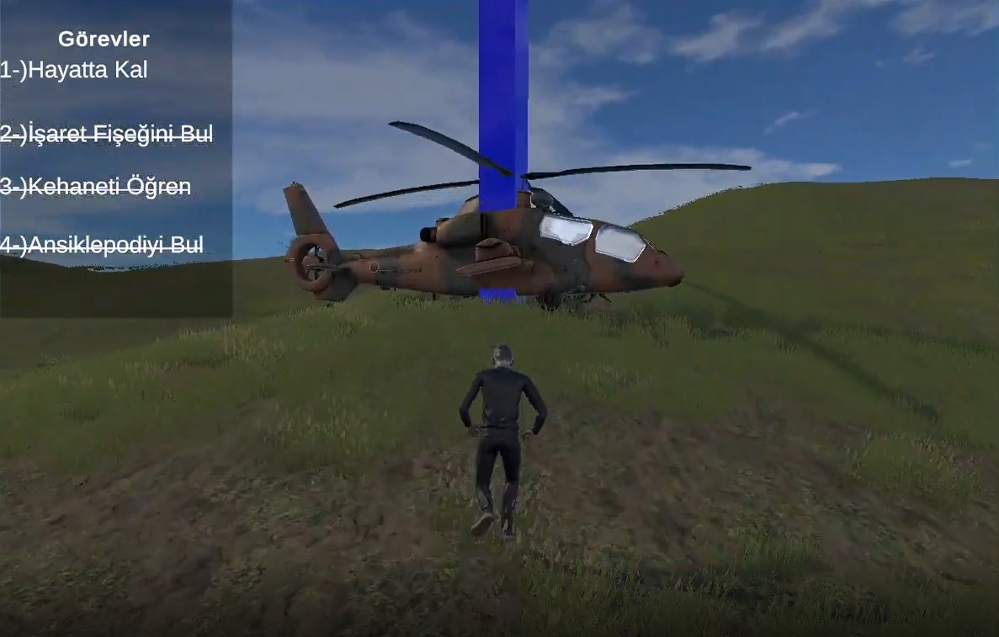

# 🏝️ Survive-Island: 3D Mystery & Survival Game

**Survive-Island** is a story-driven 3D mystery and survival game developed with C# using the Unity engine. It follows the survival struggle of a character stranded on a mysterious island after a plane crash, and their escape story by uncovering the secrets hidden deep within the island.

> 🤝 *This project is a joint team effort developed together with [Evrencan Türk](https://github.com/Noteas34).*

---

## 🖼️ Project Screenshots

*Note: You can display the images in the fields below after creating a folder named `Screenshots/` inside the repository and uploading them into it.*

| Island Atmosphere & Exploration | Mysterious Wall Inscriptions |
| :---: | :---: |
|  |  |

| Escape via Helicopter |
| :---: |
|  |

---

## 📺 Gameplay Video

You can access the high-quality promotional video, which includes the gameplay dynamics, atmosphere, and rune translation mechanics of the project, via Google Drive.

* 🌐 **Live Video Link:** [Watch Survive-Island Gameplay Video](https://drive.google.com/file/d/1ineNplY5ebDN16jETpBqKp4xEw3ljgrm/view?usp=sharing)

> 💡 **For Those Reviewing on a Computer:** You can immediately take a look at the promotional video on mobile via the QR code below using your phone's camera:
> 
> 

---

## 📖 Story and Objective of the Game

After a plane crash, you open your eyes on a deserted island. Your primary goal is to **survive and investigate the surroundings** by completing basic tasks.

* 🧩 **Mystery:** As you explore the surroundings, you realize there are mysterious inscriptions and runes on the walls that you have never seen before.
* 📚 **Clue:** You remember that during the flight, the passenger in the seat next to you was reading an encyclopedia containing ancient information about exactly these inscriptions! You need to find this **lost encyclopedia** among the plane wreckage and luggage scattered around.
* 📜 **Truth:** When you find the encyclopedia and translate the inscriptions on the walls, you learn a terrifying truth: *This island surfaces only 3 days a year!*
* 🚁 **Escape:** Before the time runs out, you must turn the island upside down, find a hidden **flare gun**, and call the helicopter to escape from this cursed island.

---

## 🛠️ Technical Infrastructure & Asset Management

While developing the project, attention was paid to clean code architecture, rune decoding algorithms, and the optimization of external assets:

* **Game Engine:** Unity 3D
* **Programming Language:** C#
* **Modeling & Visual Assets:** Sketchfab and Unity Asset Store (Character designs, trees, environmental elements, and suitcase models).
* **Animations:** Character movements, running, searching, and interaction animations have been integrated into the system via Mixamo integration.

---

## 👥 Contributors

This project has been developed jointly by a two-person team. You can access the developer profiles and GitHub pages from the cards below:

| <br /><sub><b>Bora Ilgaz Parlar</b></sub> | <br /><sub><b>Evrencan Türk</b></sub> |
| :---: | :---: |
| 💻 Developer / Designer <br /> [ BoraIlgaz ](https://github.com/BoraIlgaz) | 💻 Developer / Main Repo <br /> [ Noteas34 ](https://github.com/Noteas34) |

---

## 🚀 How to Run

If you want to open the project in the Unity Editor and examine the source codes, you can follow the steps below:

```text
1. Clone the repository to your computer:
   git clone [https://github.com/BoraIlgaz/Survive-Island.git](https://github.com/BoraIlgaz/Survive-Island.git)

2. Open the Unity Hub application.
   - Click the Projects -> Add button and select the project folder you downloaded.
   - Launch the project with the compatible Unity version.

3. Launch the project:
   - Open the main scene under the Assets/Scenes/ folder and press the Play button.
